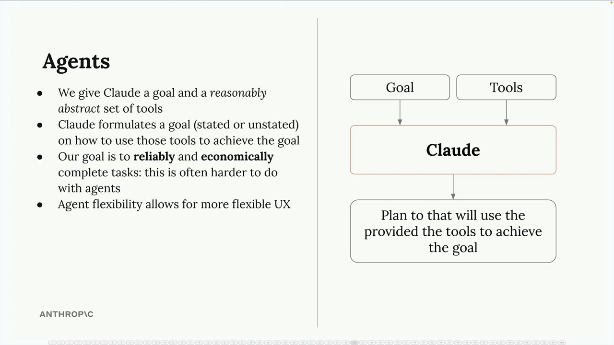
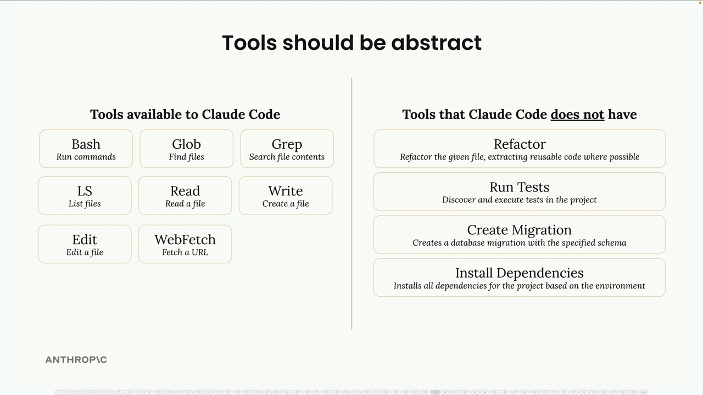

The real power of agents lies in their ability to combine simple tools in unexpected ways. 

## tools
The key insight for building effective agents is providing reasonably abstract tools rather than hyper-specialized ones. Claude Code demonstrates this principle perfectly.

 
 

## Environment inspection
 
When building AI agents, one crucial concept often gets overlooked: environment inspection. Claude operates blindly - it needs to be able to observe and understand the results of its actions to work effectively.

 

We can guide Claude to inspect its environment through system prompts. For complex tasks like video generation, this becomes especially important.

Environment inspection transforms Claude from a blind executor of commands into an agent that can truly understand and adapt to its working environment.

