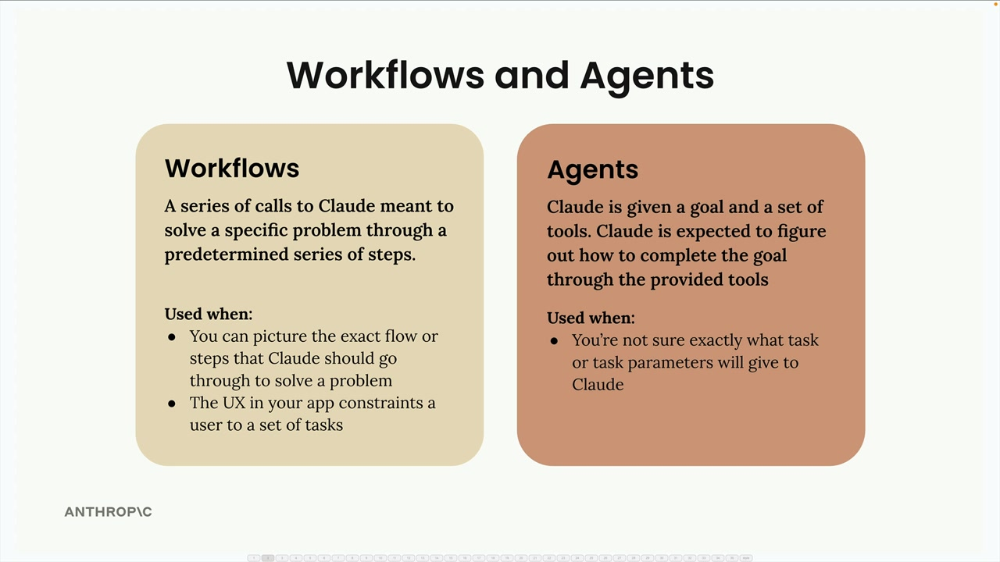

Workflows and agents are strategies for handling user tasks that can't be completed by Claude in a single request. 

 
 
 

## When to Use Workflows vs Agents
 

Use :
> - workflows when we can picture the exact flow or steps that Claude should go through to solve a problem, or when an app's UX constrains users to a set of tasks
> - Use agents when we're not sure exactly what task or task parameters we'll give to Claude
