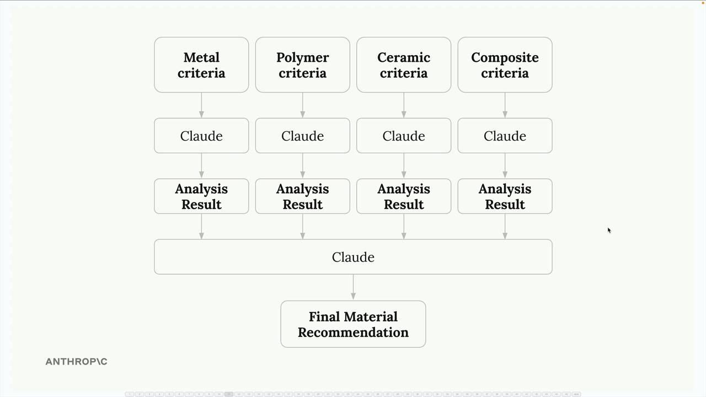
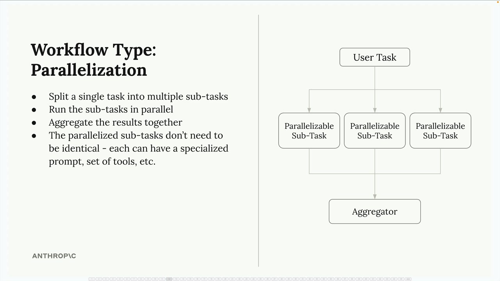

## Workflow Patterns
<br/>
<br/>


### Parallelization
<br/>

```bash
ex : We're building a material designer application where users upload images of parts and receive recommendations for the best material to use. First instinct might be to send the image to Claude with a simple prompt asking it to choose between metal, polymer, ceramic, composite, elastomer, or wood.
``` 
<br/>

Instead of having one over explained request, we can split the task into multiple parallel requests. Each request focuses on evaluating one specific part of a bigger task.

<br/>

> - Send the same image to Claude multiple times simultaneously
> - Each request includes specialized criteria for one material (metal criteria, polymer criteria, ceramic criteria, etc.)
> - Claude evaluates the part's suitability for each material independently
> - Collect all the analysis results and feed them into a final aggregation step






<br/>

#### Benefits 
<br/>

> - Focused attention: More thorough and accurate analysis for each sub task.
> - Easier optimization: Improve and test the prompts for each sub task evaluation independently. I
> - Better scalability: Don't need to rewrite existing prompts or worry about how the new criteria might interfere with existing ones.
> - Improved reliability: Reduce the cognitive load on the AI model and get more consistent, reliable results.

#### When to
<br/>

When a omplex decision can be broken down into independent evaluations. Situations where we're asking an AI to consider multiple criteria, compare several options, or make decisions that involve different domains of expertise.

The key is identifying tasks that can be meaningfully separated - each parallel sub-task should be able to operate independently and contribute a distinct piece of analysis to the final decision.

<br/>
<br/>


### Chaining

```bash
ex : We're building a social media marketing tool that creates and posts videos automatically. Rather than asking Claude to handle everything in one massive prompt, we could break it down like this:

- Find related trending topics on Twitter
- Select the most interesting topic (using Claude)
- Research the topic (using Claude)
- Write a script for a short format video (using Claude)
- Use an AI avatar and text-to-speech to create a video
- Post the video to social media
``` 
<br/>

A chaining workflow breaks down a large, complex task into smaller, sequential subtasks. Instead of asking Claude to do everything at once, we split the work into focused steps that build on each other.


#### When to
<br/>

> - Have complex tasks with multiple requirements
> - Claude consistently ignores some constraints in long prompts
> - Need to process or validate outputs between steps
> - Want to keep each interaction focused and manageable


### Routing

- social meadia app example

Instead of using a one-size-fits-all prompt, we can categorize incoming requests and route them to specialized processing pipelines.


The first step is defining the different types of content the application might need to generate. We might categorize requests into genres like:

```bash
Entertainment - High-energy, culturally relevant content with trendy language
Educational - Clear, engaging explanations with relatable examples
Comedy - Sharp, unexpected content with clever observations and timing
Personal vlog - Authentic, intimate content with conversational storytelling
Reviews - Decisive, experience-based content highlighting strengths and weaknesses
Storytelling - Immersive content using vivid details and emotional connection
``` 
Each category gets its own specialized prompt template.  


#### How Routing Works in Practice
Two steps:

> - Categorization - Send user's topic to Claude with a request to categorize it into one of your predefined genres
> - Specialized Processing - Use the category result to select the appropriate prompt template and generate content

#### When to
Routing workflows work well when:

> - Application handles diverse types of requests that need different approaches
> - Can clearly define categories that cover your use cases
> - Categorization step can be handled reliably by Claude
> - The performance benefit of specialized processing outweighs the overhead of the routing step

This pattern is especially valuable for customer service bots, content generation tools, and any application where the "right" response depends heavily on understanding the type of request being made.