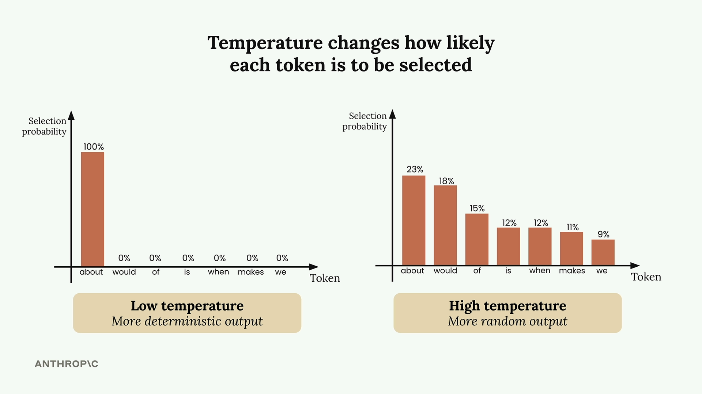
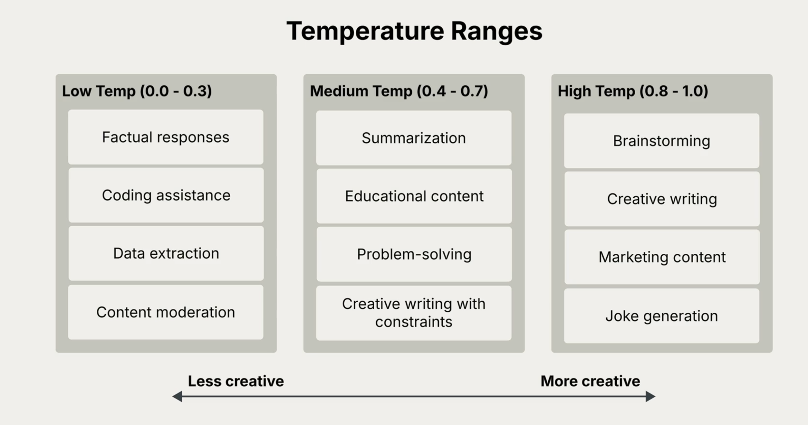

# Tempearature

A parameter that controls how predictable or creative Claude's responses will be.

 
 

## How Claude Generates Text
 

When we send Claude a prompt like "What do you think?", it goes through three key steps:

> - **Tokenization** - Breaking your input into smaller chunks
> - **Prediction** - Calculating probabilities for possible next words
> - **Sampling** - Choosing a token based on those probabilities
 
 

## What Temperature Does
 

Temperature is a decimal value between 0 and 1 that directly influences these selection probabilities. It's like adjusting the "creativity dial" on Claude's responses.
 

 
 

## Choosing the Right Temperature
 

