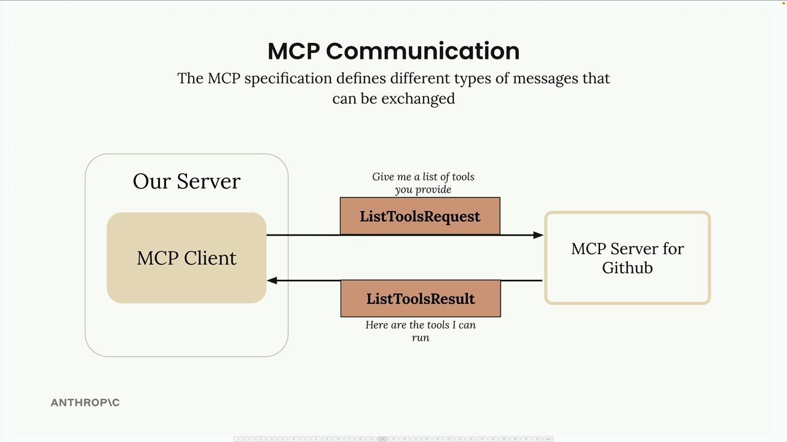
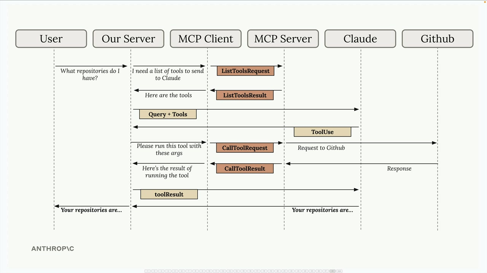

# MCP server 

<br/>
<br/>


## Def
<br/>

We can extend Claude Code's capabilities by adding MCP (Model Context Protocol) servers. It provides Claude with new tools and abilities (remotely or locally).

Ex,`Playwright` which gives Claude the ability to control a web browser. 

<br/>


## Installing Playwright

Run this command in your terminal (not inside Claude Code):

```bash
claude mcp add playwright npx @playwright/mcp@latest
``` 

This command will:
> - Names the MCP server "playwright"
> - Provides the command that starts the server locally on our machine
<br/>


## Managing Permissions

When we use MCP server tools, Claude will ask for permission each time. We can pre-approve the server by editing our settings.

Open the `.claude/settings.local.json` file and add the server to the allow array:

```bash
{
  "permissions": {
    "allow": ["mcp__playwright"],
    "deny": []
  }
}
``` 
This allows Claude to use the Playwright tools without asking for permission every time.

Practical Example: Improving Component Generation

```bash
# ex 1
Navigate to localhost:3000, generate a basic component, review the styling, and update the generation prompt at @src/lib/prompts/generation.tsx to produce better components going forward.


# ex 2
Your goal is to improve the compmonent generation prompt at @src/lib/prompts/generation.tsx. Here's how:\
1. Open a browser and navigate to localhost:3000\
2. Request a basic component to be generated\
3. Review the generated component and its source code\
4. Identify areas for improvement\
5. Update the prompt to produce better components going forward.\
For now, only evaluate visual styling aspects. We don't want components generated that look like typical tailwindcss components we want something more original.
``` 


## Exploring Other MCP Servers

The ecosystem includes servers for:

- Database interactions : Supabase 
- Dev workflows	: [GitHub](./github.md), Supabase, Figma
- API testing and monitoring
- Doc : Context7
- File system operations
- Cloud service integrations : Zapier 
- Development tool automation
- Workstream Awareness : Slack & Notion 
- Web scrapping : Apify


<br/>
<br/>
<br/>

## MCP Communication


<br/>




<br/>
<br/>
<br/>

## MCP Communication flow


