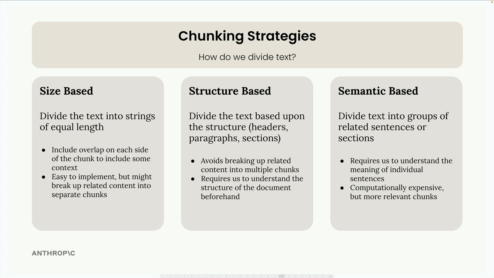

# Retrieval Augmented Generation (RAG)


RAG is a technique that helps us work with large documents that are too big to fit into a single prompt. Instead of cramming everything into one massive prompt, RAG breaks documents into chunks and only includes the most relevant pieces when answering questions.
<br/>
<br/>
<br/>


## When to Use RAG

RAG involves many technical decisions and requires more work than simply including everything in a prompt. 
<br/>

We need to analyze whether the benefits outweigh the complexity for the app. It's especially valuable when working with very large documents, multiple documents, or when one need to optimize for cost and performance.
<br/>

The key insight is that RAG trades simplicity for scalability and efficiency. While it requires more upfront work to implement properly, it enables us to work with document collections that would be impossible to handle with simple prompt stuffing.

<br/>
<br/>
<br/>

## Pipeline
<br/>

```bash
"Extracting text chuchks from the doc to study" -> Chunking strategie
   ↓
"Link user question to the relevant(s) text" -> Semantic Search through text embeddings
   ↓
""
   ↓
""
   ↓
""
``` 
<br/>
<br/>

### Chunking strategie


<br/>
<br/>

### Semantic Search
<br/>

The most common approach for finding relevant chunks is `semantic search`. Unlike keyword-based search that looks for exact word matches, semantic search uses text embeddings to understand the meaning and context of both the user's question and each text chunk.

Since Anthropic doesn't currently provide embedding generation, the recommended provider is VoyageAI.
Use a vector DB to store the embeddings, then we will find most similar embeddings using cosine similarity.
 