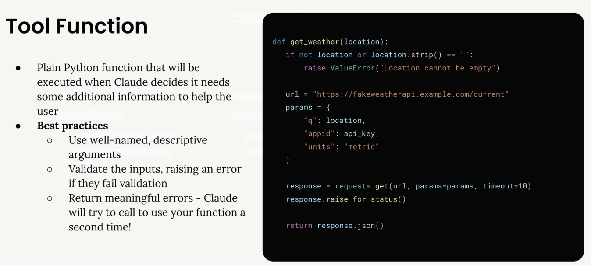
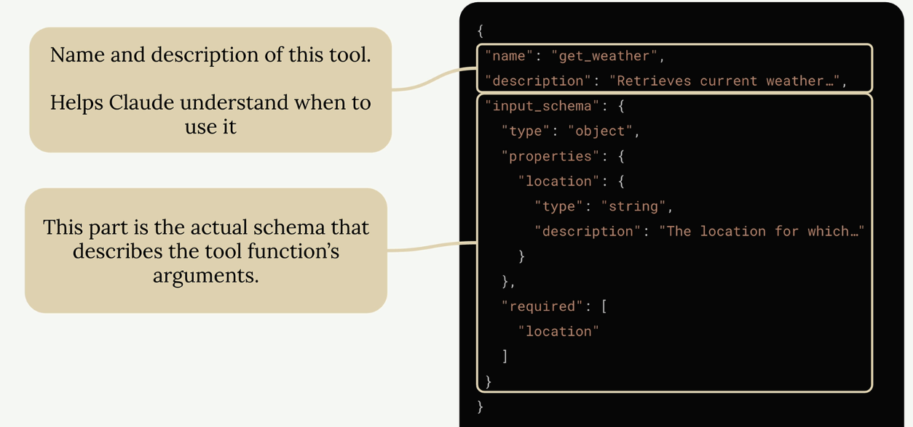
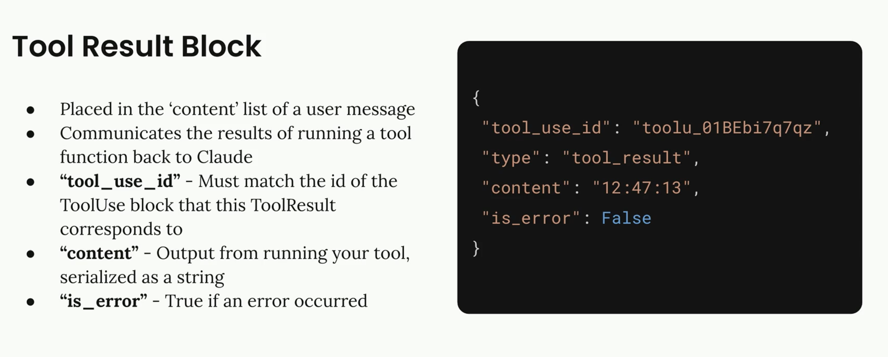
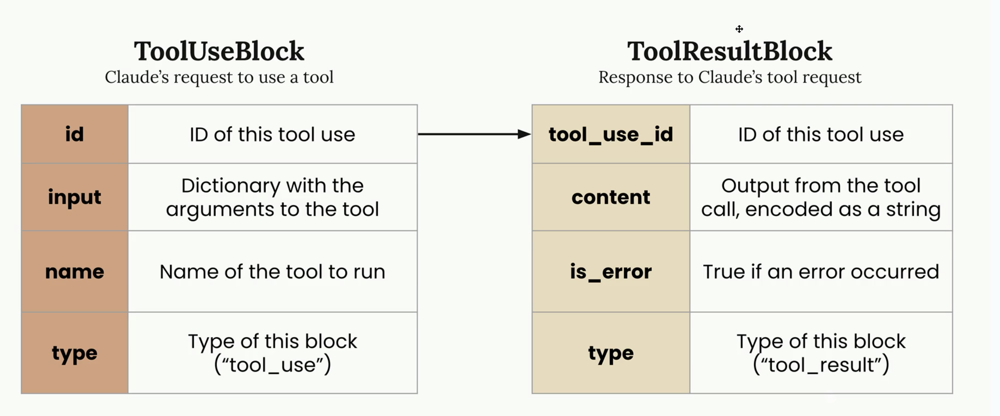
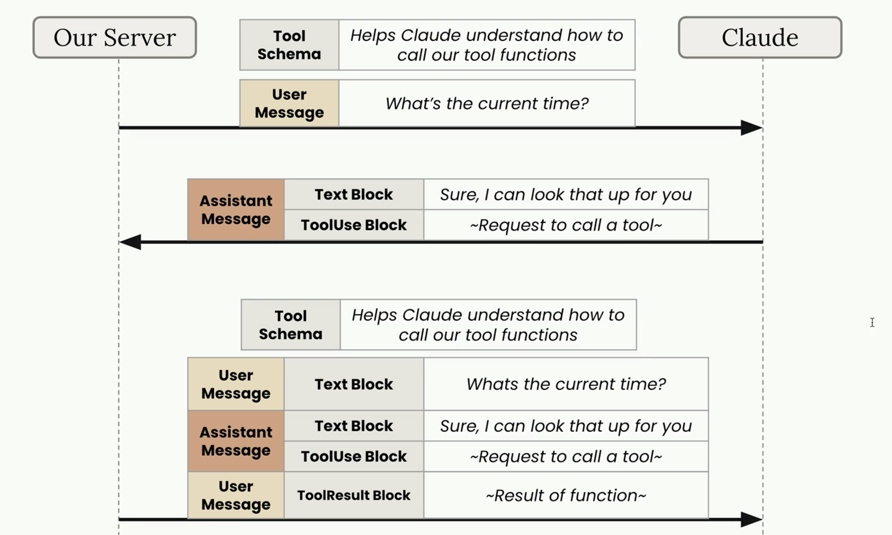
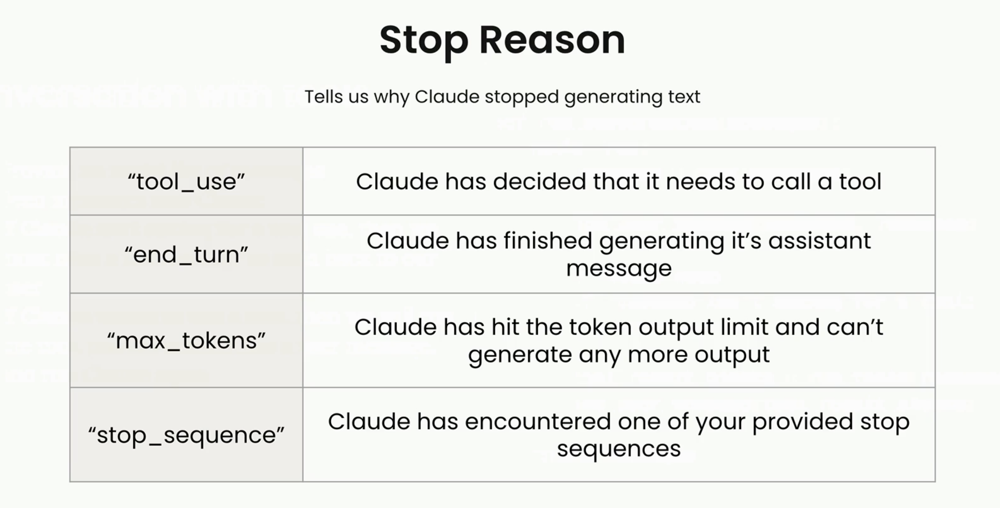

## Lyfe cycle 

```bash
  Write a tool function
        ↓
  Write a JSON schema
        ↓
Call Claude with the Json Schema 
         ↓
      Run tool
         ↓
Add tool result and call Claude again
```  

## Tool Functions
<br/>

A tool function is a plain Python function that gets executed automatically when Claude decides it needs extra information to help a us. For example, if we ask "What time is it?", Claude would call our `date/time` tool to get the current time.

Here's an example of a weather tool function. 




> [!IMPORTANT]
> Always validate inputs and provides clear error messages - these are important best practices.
<br/>
<br/>
<br/>

### Best Practices for Tool Functions
<br/>


> - Use descriptive names: Both the function name and parameter names should clearly indicate their purpose
> - Validate inputs: Check that required parameters aren't empty or invalid, and raise errors when they are
> - Provide meaningful error messages: Claude can see error messages and might retry the function call with corrected parameters

The validation is particularly important because Claude learns from errors. If we raise a clear error like `Location cannot be empty`, Claude might try calling the function again with a proper location value.

<br/>
<br/>
<br/>

## JSON Schema

Used to informed Claude about the different existing tools (i.e, Doc) 
The complete tool specification has three main parts:

> - Name - A clear, descriptive name for your tool (like "get_weather")
> - Description - What the tool does, when to use it, and what it returns
> - Input_schema - The actual JSON schema describing the function's arguments




### Making Tool-Enabled API Calls
To enable Claude to use tools, we need to include a tools parameter in the API call. Here's how to structure the request:

```bash

messages = []
messages.append({
  "role": "user",
  "content": "What is the exact time, formatted as HH:MM:SS?"
})

response = client.messages.create(
  model=model,
  max_tokens=1000,
  messages=messages,
  tools=[get_current_datetime_schema],
)
``` 

The tools parameter takes a list of JSON schemas that describe the available functions Claude can call.

<br/>







<br/>
<br/>

**Recap**
<br/>

> - write a tool function and tool schema
> - the tool schema should be added to every request done 
> - text block: intented to be dispolay to the user, send from Claude to our server 
> - Tool use block include info about tool that claude need to use, send from Claude to our server  
> - Tool result block is used to inform Claude about the result of running a tool function, send from our server to Claude





<br/>
<br/>

Field use by Claude to inform why it decided to generate more text




<br/>
<br/>

## Fine-Grained Tool Calling
<br/>

For faster, more granular streaming - perhaps to show users immediate updates or start processing partial results quickly - we can enable `fine-grained` tool calling.


`Fine-grained` tool calling does one main thing: it disables JSON validation on the API side. 
This means:

> - We get chunks as soon as Claude generates them
> - No buffering delays between top-level keys
> - More traditional streaming behavior

Enable it by adding fine_grained=True to your API call:


```bash
run_conversation(
  messages, 
  tools=[save_article_schema], 
  fine_grained=True
)
```

> [!IMPORTANT]
> With this option to true, JSON validation is disabled - the backend code must be able to handle invalid JSON


With fine-grained tool calling, we might receive a `word_count` value much earlier in the stream, without waiting for the entire meta object to be completed.